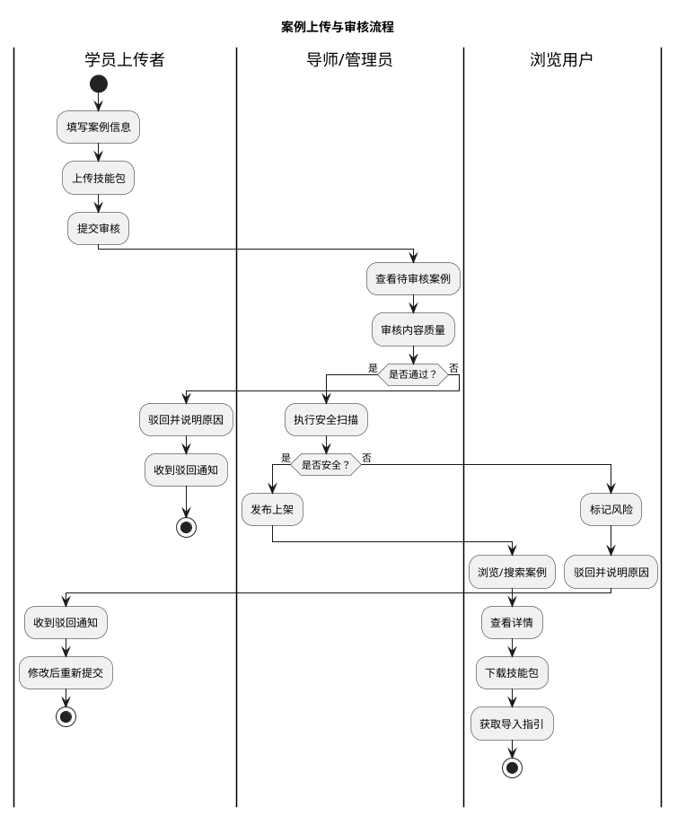

# 学员案例库系统 - 需求概述

## 优化后的需求摘要

学员案例库系统：面向合一AI效能实验室学员及潜在学员的 Skills 分享平台。学员可上传优秀 Skills（含代码、截图、描述），导师审核后入库。用户可浏览、搜索、下载 Skills，并获取导入 OpenClaw / Claude Code 的指引。平台需支持分类标签、使用数据统计、内容安全审核，部署为独立网站。

---

## 干系人分析

| 干系人名称 | 关注点 |
|:---|:---|
| 管理层（Andy） | 平台能否提升训练营价值感和口碑、学员活跃度是否提升、案例质量是否可控 |
| 导师/管理员 | 审核效率是否高效、案例质量把控、敏感内容过滤、管理成本 |
| 学员（上传者） | 上传流程是否简单、作品是否能被看到、成就感反馈（浏览量/下载量） |
| 学员（学习者） | 搜索是否精准、下载导入是否便捷、能否快速找到适合自己的案例 |
| 潜在学员 | 通过案例库了解训练营价值、激发报名意愿 |
| 合规部门 | 内容是否涉及敏感信息、版权问题、是否符合网络安全法规 |

---

## 角色识别

| 角色类型 | 系统中对应名称 | 使命描述 |
|:---|:---|:---|
| 内容创建者 | 学员上传者 | 提交自己开发的 Skills 案例到平台，填写描述、截图、使用说明，获取曝光和认可 |
| 内容审核者 | 导师/管理员 | 审核待发布的 Skills 案例，确保质量、安全性和完整性，执行上架或驳回操作 |
| 内容消费者 | 浏览用户 | 浏览、搜索、筛选案例库，查看详情、下载 Skills、获取导入指引 |
| 系统维护者 | 超级管理员 | 管理分类标签、配置系统参数、查看数据统计、处理举报内容 |
| 访客 | 匿名访客 | 未登录用户可浏览公开内容，但下载需注册/登录 |

---

## 流程图

